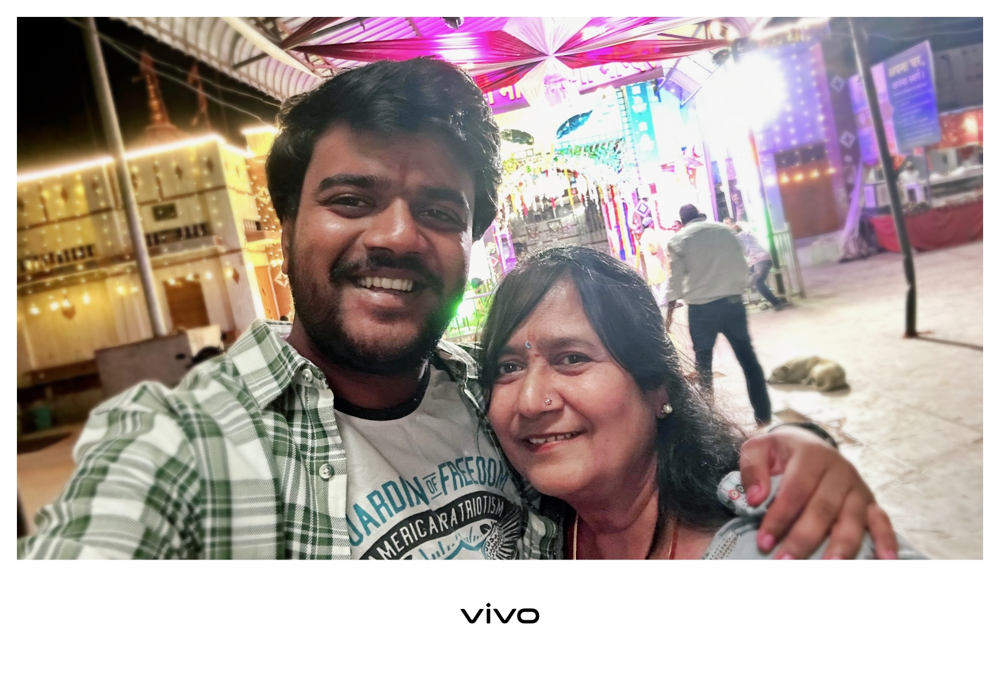

<!DOCTYPE html>
<html lang="en">
<head>
<meta charset="UTF-8">
<title>Happy Birthday Mom ❤️</title>

</head>

<body>

  

  

    
    <!-- Page 1 -->
    

      <h2>🎉 Happy Birthday Mom 🎉</h2>
      
You are my queen 👑 and my biggest blessing ❤️

      <button onclick="nextPage()">Next ➡</button>
    

    <!-- Page 2 -->
    

      
      
Thank you for your love, care, and everything you do 💖

      <button onclick="nextPage()">Next ➡</button>
    

    <!-- Page 3 -->
    

      <h3>I Love You Mom ❤️</h3>
      
Wishing you endless happiness and joy 🎂

    

  

<!-- Birthday Song -->
<audio id="song" src="https://www.soundhelix.com/examples/mp3/SoundHelix-Song-1.mp3"></audio>

</body>
</html>
